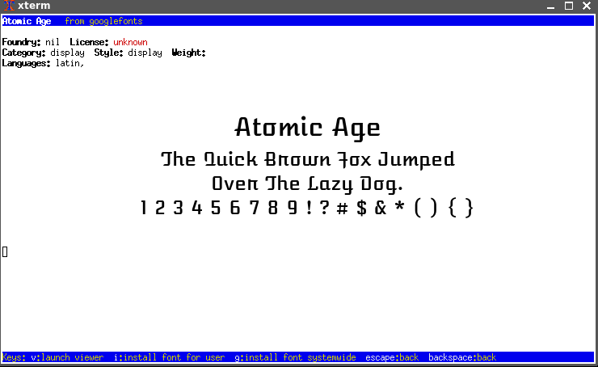
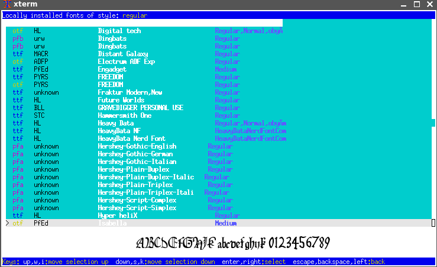

AUTHOR
======

Fontporter, libUseful-lua and libUseful are (C) 2020 Colum Paget. They are released under the Gnu Public License so you may do anything with them that the GPL allows.

Email: colums.projects@gmail.com


SYNOPSIS
========

Fontporter is a terminal font viewer and installer that supports font previews using the sixel system, allowing graphics to be viewed in supporting terminals such as xterm. It can install fonts from googlefonts, fontsquirrel, fontsource.org, nerdfonts.com, omnibus-type, Mozilla's CDN and from a list of fonts available 'elsewhere'.

INSTALL
=======

Fontporter requires both libUseful (https://github.com/ColumPaget/libUseful) and libUseful-lua (https://github.com/ColumPaget/libUseful-lua) to be installed. Font preview requires image magick to be installed (at least the 'convert' command) in order to create the preview image. 

The fontporter code is broken up into modules, but the combined 'fontporter.lua' executable ships with the source. You can rebuild it with 'make' if you change anything in the modules.

You can either run it as 'lua fontporter.lua' or, as I do, use linux's binfmt system to automatically invoke lua.

`make install` will copy fontporter.lua to the 'bin' directory in the users home directory, it will also copy the 'fonts-elsewhere.conf' file that lists fonts online to `.config/fontporter/` in the users home directory. Alternatively you can copy `fontporter.lua` manually to somewhere in your `$PATH`.

The 'fonts-elsewhere.conf' file that can either be put in the '/etc' or '/etc/fontporter.d' in order to make it accessible to all users on a system. 


USAGE
=====

Currently fontporter has the following command-line options:

```
  -sixel                activate sixel font previews
  -viewer <prog>        set viewer to use for previews
  -fontsdir <path>      set fonts directory
	-?                    display help
	-h                    display help
	-help                 display help
	--help                display help
```

The 'fonts directory' is the directory that fonts are installed into when the user choses 'system wide install'. It defaults to `/usr/share/fonts`.

'sixel mode' requires image-magick to be installed to produce the font previews, and a terminal with the sixel feature enabled to display them.

the 'viewer' option allows supplying the name or path of an image viewer program to view font previews. Font previews require image-magick installed to generate them.

The app is menu-driven, and can be navigated using the arrow keys, or w,s,enter,backspace or i,k,enter,backspace, or any combination of these. When a font is selected from any of the menus for external fonts, it can be installed either in the user's font directory (~/.local/share/fonts) using the 'i' key, or in the systemwide fonts directory (default: '/usr/share/fonts') using the 'g' key. System-wide install requires permission to write into the target directory, and to update the font-config cache, so it's often best to just run the app using sudo.


PREVIEW
=======

Fonts can be previewed either by activating sixel mode or by pressing 'v' in the font screen. The 'v' key activates a font viewer, currently one of "display", "feh", "fim", "sxiv", "xv", "giv" or "meh". (If you want to use another image viewer use the '-viewer' command-line option).

Preview requires image magick's 'convert' command to be available.

PCF and OTB fonts cannot be previewed at current.

Fonts to be previewed are downloaded into '~/.font_preview'. Nothing has yet been implemented to clear out this directory, so it will tend to fill up over time.

sixel-mode preview requires a terminal emulator that supports sixel display. xterm supports this if run as `xterm -ti vt340`.


TODO
====

Find a way to preview PCF and OTB fonts.
Find a way to organize fonts by supported languages.
Offer preview for different language/character sets
Add cache-cleanup system to clean out ~/.font_preview directory
Maintain style/language/license information of downloaded fonts (this is currently lost).
Add management functions to allow grouping fonts into use-cases.


SCREENSHOTS
===========


## Viewing a font from googlefonts in xterm-sixel mode




## localfonts sixel-mode browsing preview


